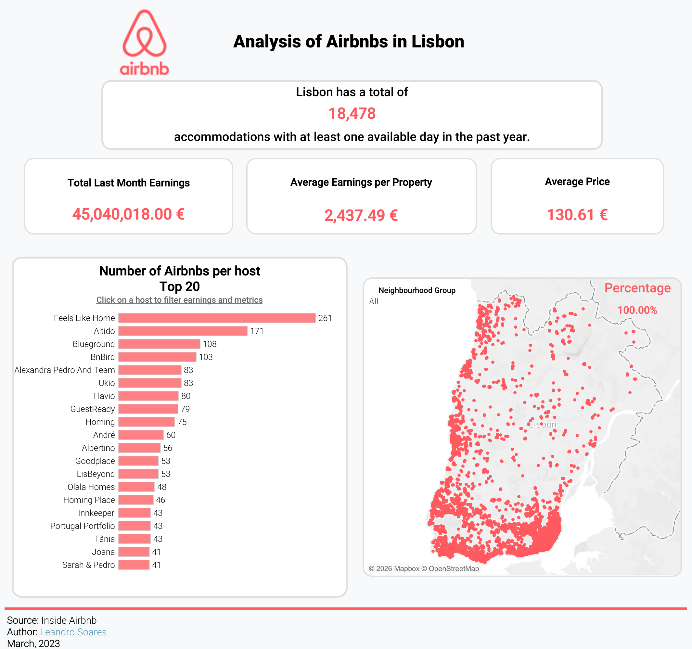

# Lisbon Airbnb Market Analysis

An exploratory data analytics project investigating the short-term rental market in Lisbon, Portugal, using **Python**, **SQL**, and **Tableau**.

---

## 📌 Project Objectives

The primary goal of this project is to analyze Airbnb listings in the Lisbon area by investigating four key aspects:

1. **Availability:** Determine the count of accommodations with at least one day of availability over the past year.
2. **Geographic Distribution:** Identify the geographical areas where these properties are situated across the region.
3. **Financial Performance:** Calculate the total earnings generated in the previous month alongside their corresponding averages per property.
4. **Host Dynamics:** Assess the distribution of properties per host and analyze their respective earnings.

---

## 💡 Key Highlights & Metrics

* **Active Accommodations:** 18,478 listings with at least 1 available day in the past year.
* **Geographical Distribution:** Mapped concentration of properties highlighting key clusters within Lisbon neighborhoods.
* **Monthly Revenue:** €45.04M total earnings generated across all active properties in the last month.
* **Averages & Prices:** Average nightly price of €130.61 and €2,437.49 average monthly earnings per property.
* **Host Market Share:** Concentration analysis of top property managers (e.g., *Feels Like Home* leading with 261 listings).

---

## 🛠️ Data Pipeline & Workflow

1. **Extraction & Ingestion (`Python / Jupyter Notebook`):**
   * Source data extracted from [Inside Airbnb](https://insideairbnb.com/).
   * Processed raw CSV files using Pandas and loaded them into a local MySQL database.

2. **Data Transformation & Querying (`SQL`):**
   * Filtered properties based on availability criteria.
   * Queried revenue metrics, average prices, and host distribution counts using SQL.

3. **Data Visualization (`Tableau Public`):**
   * Built an interactive dashboard to present key financial KPIs, host rankings, and map-based geographic distribution.
   * **[🔗 View Interactive Tableau Dashboard](https://public.tableau.com/app/profile/leandro.soares5108/viz/Libro2_16847989419900/Dashboard1)**

---

## 🗓️ Dataset Info
* **Source:** [Inside Airbnb](https://insideairbnb.com/) (Lisbon dataset March 2023)

---

## 👤 Author 

Leandro Soares: [LinkedIn Profile](https://www.linkedin.com/in/leandro-soares-91912097/)
